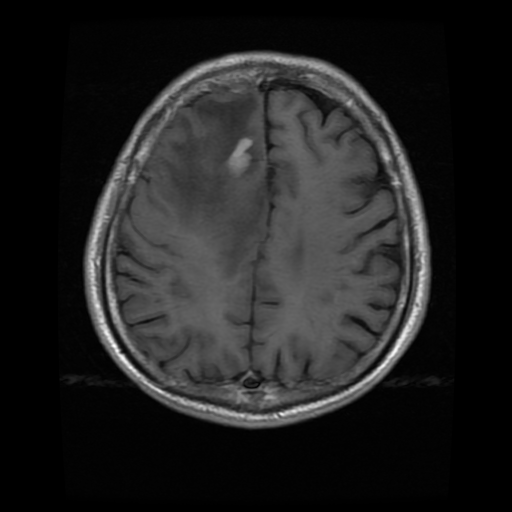
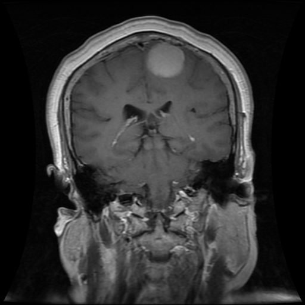
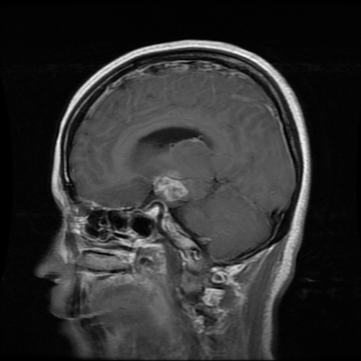
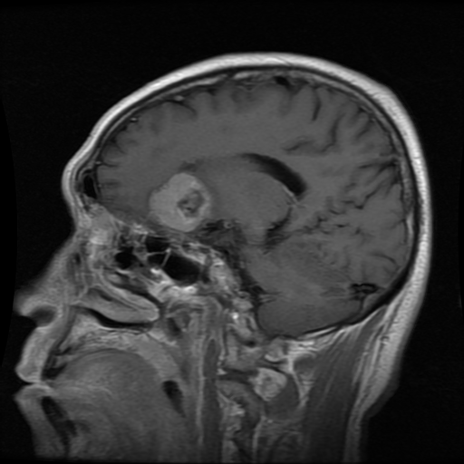

# Brain Tumor Classification

Code for the classification of brain tumors using convolutional neural networks (CNNs). The tests rely on two datasets from [Figshare](https://figshare.com/articles/dataset/brain_tumor_dataset/1512427) and [Kaggle](https://www.kaggle.com/datasets/sartajbhuvaji/brain-tumor-classification-mri). 

It classifies four different types of tumors: *gliomas*, *meningiomas*, *pituitary tumors*, and *no-tumors*.

| Glioma | Meningioma | Pituitary Tumor | No-tumor |
|--------|------------|-----------------|----------|
|| |||
|| |||

## Reference

More information about this work in:

[1] Daniel Reyes and Javier Sánchez, *Performance of Convolutional Neural Networks for the Classification of Brain Tumors using Magnetic Resonance Images*, Preprint, 2023
